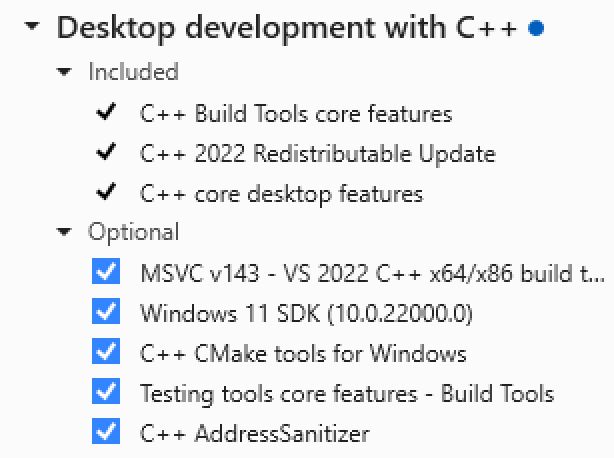

# Herding Spikes 2

---
**Update**

This is the latest version 0.3.99, which introduces compatbility with [SpikeInterface](https://github.com/SpikeInterface/spikeinterface) version 0.90+ (note version 0.10 is no longer supported). SpikeInterface wraps many spike sorters, can read almost any file format and contains other useful functionality into a single code base. We will soon transition to a version of Herding Spikes that fully integrates with SpikeInterface. The example notebooks in this repository illustrate the main HS2 functionality, but do not run at the moment as the data links have become stale. 

---

## Software for high density electrophysiology

This software provides functionality for the detection, localisation and clustering of spike data from dense multielectrode arrays based on the methods described in the following papers:

J.-O. Muthmann, H. Amin, E. Sernagor, A. Maccione, D. Panas, L. Berdondini, U.S. Bhalla, M.H. Hennig MH (2015). [Spike detection for large neural populations using high density multielectrode arrays](http://journal.frontiersin.org/article/10.3389/fninf.2015.00028/abstract). Front. Neuroinform. 9:28. doi: 10.3389/fninf.2015.00028.

G. Hilgen, M. Sorbaro, S. Pirmoradian, J.-O. Muthmann, I. Kepiro, S. Ullo, C. Juarez Ramirez, A. Puente Encinas, A. Maccione, L. Berdondini, V. Murino, D. Sona, F. Cella Zanacchi, E. Sernagor, M.H. Hennig (2016). [Unsupervised spike sorting for large scale, high density multielectrode arrays.](http://www.cell.com/cell-reports/fulltext/S2211-1247(17)30236-X) Cell Reports 18, 2521–2532. bioRxiv: <http://dx.doi.org/10.1101/048645>.

This implementation is highly efficient, spike detection and localisation runs in real time on recordings from 4,096 channels at 7kHz on a desktop PC. Large recordings with millions of events can be sorted in minutes.

Since we believe publicly funded research code should be free and open, all code is released under GPL-3.0.

### Supported systems  

- [3Brain](http://3brain.com/) BIOCAM and BIOCAM X
- [Neuropixel array](https://www.ucl.ac.uk/neuropixels)
- [ETH MEA1K](https://www.bsse.ethz.ch/bel/research/cmos-microsystems/microelectrode-systems.html)
- any data formast supported by [SpikeInterface](https://github.com/SpikeInterface/spikeinterface)

## Contributors, alphabetical 

- [Matthias Hennig](http://homepages.inf.ed.ac.uk/mhennig/index.html): Spike sorting
- [Jano Horvath](https://github.com/JanoHorvath): Parameter optimisation
- [Cole Hurwitz](https://github.com/colehurwitz31): Spike detection, localisation and sorting, C++ code
- [Oliver Muthmann](mailto:ollimuh@googlemail.com): Spike detection and localisation
- [Albert Puente Encinas](https://github.com/albertpuente): C++ implementation, optimisation and parallelisation
- [Martino Sorbaro](http://martinosorb.github.io): Spike sorting, class structure and much of the python code
- [Cesar Juarez Ramirez](mailto:cesaripn2@gmail.com): Visualisation
- [Raimon Wintzer](https://github.com/lsIand): GUI and visualisation

## Quick start 

The code has been tested with Python version 3.6 and above. If your system does not have Python pre-installed, the [Anaconda distribution](https://www.anaconda.com/download/) may be used.

### All operative systems - Installation via pip

We suggest you use Anaconda if you don't have a favourite Python installed yet. We also recommend installing the code in a virtual environment (see below in the "from source" sections).

A pip distribution is available and can be installed as follows:

    pip install herdingspikes

To install from source, clone this repository and follow the instructions below.

### Linux/Mac - from source

The module can automatically be installed, including all dependencies, by cloning this repository:

    git clone https://github.com/mhhennig/HS2.git
    
Then run:
    
    pip install numpy scipy
    python setup.py install

### Windows

#### 1. Visual Studio

The C++ code in Herding Spikes requires the Microsoft C++ Build tools. Install them from [https://visualstudio.microsoft.com/visual-cpp-build-tools/](https://visualstudio.microsoft.com/visual-cpp-build-tools/). For a minimal setup, choose ``Desktop development with C++``:

and select these packages:

#### 2. Python and Herding Spikes

Install [Anaconda](https://www.anaconda.com/download/#windows) ands create a Python environment. This can be done with the ``Anaconda Navigator`` per mouse click.

Then opoen a ternminal in the newly created environment and type

    pip install herdingspikes

## Example code

Example code for the different supported systems is in the folder [notebooks](notebooks). These can be run without installing HS2 system-wide, but requires to run ``python setup.py build_ext --inplace`` in the ``HS2`` directory. Next, run ``jupyter notebook`` and navigate to the directory to try the code. Each notebook will download a short segment of raw data.

Go [here](documentation) for documentation. A worked example for Biocam data is [here](documentation/biocam/BioCam-demo.md).

## Contact

The herders are based at the School of Informatics, University of Edinburgh. Contact us [here](http://homepages.inf.ed.ac.uk/mhennig/contact/), we are happy to help.   
