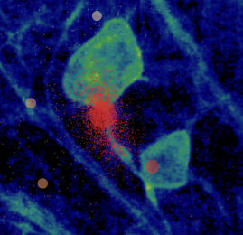

# Herding Spikes 2

## Software for high density electrophysiology

This software provides functionality for the detection, localisation and clustering of spike data from dense multielectrode arrays based on the methods described in the following papers:

J.-O. Muthmann, H. Amin, E. Sernagor, A. Maccione, D. Panas, L. Berdondini, U.S. Bhalla, M.H. Hennig MH (2015). [Spike detection for large neural populations using high density multielectrode arrays](http://journal.frontiersin.org/article/10.3389/fninf.2015.00028/abstract). Front. Neuroinform. 9:28. doi: 10.3389/fninf.2015.00028.

G. Hilgen, M. Sorbaro, S. Pirmoradian, J.-O. Muthmann, I. Kepiro, S. Ullo, C. Juarez Ramirez, A. Puente Encinas, A. Maccione, L. Berdondini, V. Murino, D. Sona, F. Cella Zanacchi, E. Sernagor, M.H. Hennig (2016). [Unsupervised spike sorting for large scale, high density multielectrode arrays.](http://www.cell.com/cell-reports/fulltext/S2211-1247(17)30236-X) Cell Reports 18, 2521–2532. bioRxiv: <http://dx.doi.org/10.1101/048645>.

This implementation is highly efficient, spike detection and localisation runs in real time on recordings from 4,096 channels at 7kHz on a desktop PC. Large recordings with millions of events can be sorted in minutes.

Since we believe publicly funded research code should be free and open, all code is released under GPL-3.0.

### Supported systems  

- [3Brain](http://3brain.com/) BIOCAM and BIOCAM X
- [Neuropixel array](https://www.ucl.ac.uk/neuropixels)
- [ETH MEA1K](https://www.bsse.ethz.ch/bel/research/cmos-microsystems/microelectrode-systems.html)
- [128 channel Neuroseeker array](http://neuroseeker.eu/)

## Contributors, alphabetical 

- [Matthias Hennig](http://homepages.inf.ed.ac.uk/mhennig/index.html): Spike sorting
- [Jano Horvath](https://github.com/JanoHorvath): Parameter optimisation
- [Cole Hurwitz](https://github.com/colehurwitz31): Spike detection, localisation and sorting, C++ code
- [Oliver Muthmann](mailto:ollimuh@googlemail.com): Spike detection and localisation
- [Albert Puente Encinas](https://github.com/albertpuente): C++ implementation, optimisation and parallelisation
- [Martino Sorbaro](http://martinosorb.github.io): Spike sorting, class structure and much of the python code
- [Cesar Juarez Ramirez](mailto:cesaripn2@gmail.com): Visualisation
- [Raimon Wintzer](https://github.com/lsIand): GUI and visualisation

## Quick start 

The code has been tested with Python version 3.6. It is essential `numpy` is available before installing.
The other dependencies will be installed by the installer.

If your system does not have Python pre-installed, the [Anaconda distribution](https://www.anaconda.com/download/) may be used.

### All operative systems - Installation via pip

We suggest you use Anaconda if you don't have a favourite Python installed yet. We also recommend installing the code in a virtual environment (see below in the "from source" sections).

A pip distribution is available and can be installed as follows:

    pip install numpy scipy
    pip install herdingspikes

**Note:** HerdingSpikes is tested on Python 3.5 and above. It *may* work on Python 3.0-3.4.

To install from source, clone this repository and follow the instructions below.

### Linux/Mac - from source

We suggest you install the code in a virtual environment. You can create one by running

    python3 -m venv --system-site-packages desired/location/HS2venv
    source desired/location/HS2venv/bin/activate

You can omit `--system-site-packages` if you don't want to use the local versions of common Python libraries. You will need to `activate` whenever you're using the module.

The module can automatically be installed, including all dependencies, by running

    pip install numpy scipy
    python setup.py install

### Windows - from source

#### 1. Creating a Python virtual environment

##### Option 1: GUI

Once [Anaconda](https://www.anaconda.com/download/#windows) is installed, create and activate a virtual environment called ``HS2env``. This can be done with the ``Anaconda Navigator`` per mouse click. To make sure ``numpy`` and ``Cython`` are available, type

    conda install -n C:\Users\HS2env numpy

##### Option 2: Command line (from source)

Alternatively, open the ``Anaconda Prompt`` and type:

    conda search "^python$"

This will display a list of available python versions. Here we choose 3.6.5:

    conda create -n C:\Users\HS2env python=3.6.5 anaconda

This environment should be activated every time HS2 is used with the command

    conda activate C:\Users\HS2env

To make sure ``numpy`` is available, type

    conda install -n C:\Users\HS2env numpy

#### 2. Installing a C++ Compiler

HS2 contains fast C++ code, which requires a compiler. If you don't have a C++ compiler installed, the easiest solution is to download and install the Microsoft Visual Studio Build Tools: [https://www.visualstudio.com/downloads/#build-tools-for-visual-studio-2017](https://www.visualstudio.com/downloads/#build-tools-for-visual-studio-2017).

#### 3. Obtaining and installing HS2

##### Getting the code

**Either** download and uncompress: [https://github.com/mhhennig/HS2/archive/master.zip](https://github.com/mhhennig/HS2/archive/master.zip)

**Or** install ``git`` from [https://git-scm.com/download/win](https://git-scm.com/download/win). Then open a command prompt and type

    git clone https://github.com/mhhennig/HS2.git

This will create a folder ``HS2`` in the current directory. Note that updates can now be simply retrieved by typing ``git pull``.

##### Install

To install, go to the HS2 directory, e.g.

    cd HS2

and type

    python setup.py install

Now HS2 will be available in the current virtual environment.

## Example code

Example code for the different supported systems is in the folder [notebooks](notebooks). These can be run without installing HS2 system-wide, but requires to run ``python setup.py build_ext --inplace`` in the ``HS2`` directory. Next, run ``jupyter notebook`` and navigate to the directory to try the code. Each notebook will download a short segment of raw data.

Go [here](documentation) for documentation. A worked example for Biocam data is [here](documentation/biocam/BioCam-demo.md).

## Contact

The herders are based at the School of Informatics, University of Edinburgh. Contact us [here](http://homepages.inf.ed.ac.uk/mhennig/contact/), we are happy to help.   
