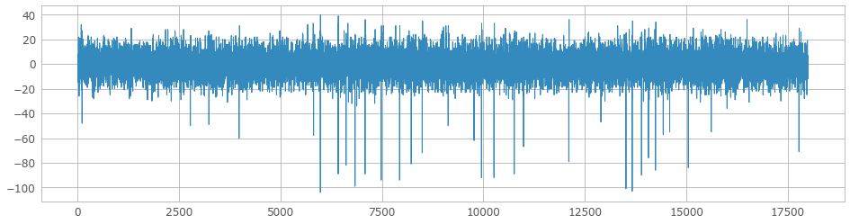
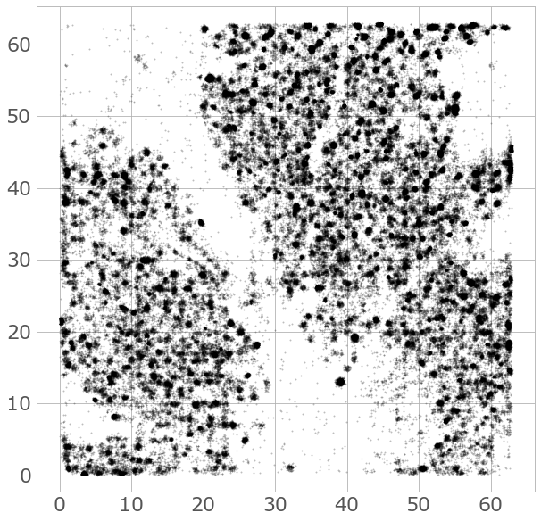
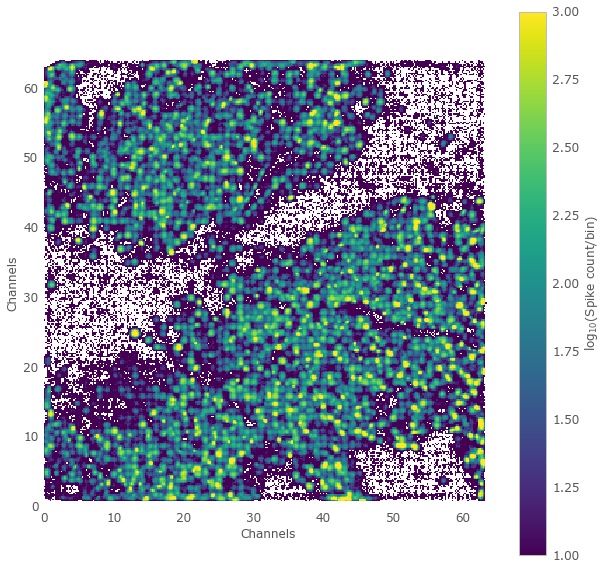
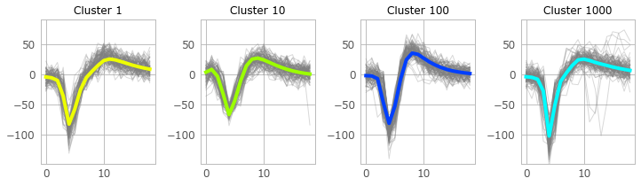
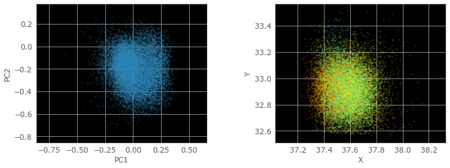
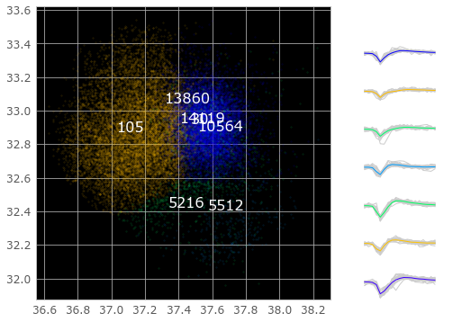

# HS2 tutorial for Biocam data

## Imports

```python
# path to the HS2 code, for imports
hs2_dir = '/path/to/HS2/'

from datetime import datetime
import sys, os

sys.path.append(hs2_dir)

from hs2 import HSDetection
from hs2 import HSClustering
from probe import BioCam

import matplotlib.pyplot as plt
import numpy as np
import pylab
```

## Set up the detection parameters

```python
# PARAMETERS
##########################

# raw data file
data_file = 'P91_05_07_17_basicshort_stim1_ctl.brw'
out_file = data_file.replace('.brw','')

# detection parameters
##########################

to_localize = True

# Spike cut-out size (values below are for 7kHz)
cutout_start = 4
cutout_end = 14
cutout_length = cutout_end+cutout_start+1

# detection threshold
threshold = 16

```

## Set up the probe object

```python

Probe = BioCam(data_file, masked_channels=None)
H = HSDetection(Probe, to_localize, cutout_start, cutout_end, threshold,
                maa=0, maxsl=12, minsl=3, ahpthr=0, out_file_name=out_file, save_all=False)

```

    # 3Brain data format: 101 signal inversion 1.0
    #       signal range:  -4125.0 - 4125.0
    # Signal inversion looks like 1.0, guessing he right method for data access.
    # If your detection results look strange, signal polarity is wrong. With 3Brain you never know when they swap it next :)


## Plot raw data from one channel


```python
t1,t2 = 0,18000
data = Probe.Read(t1,t2).reshape(t2-t1,Probe.num_channels)
plt.figure(figsize=(16,4))
ch = 2786
plt.plot(data[:20000,ch])
```




# Spike detection


```python
# parameters:
#  tInc - number of frames to read in one batch (should not exceed available memory)
#  nFrames - number of frames to analyse, if not given, the whole recording will be analysed

H.DetectFromRaw(tInc=500000)
```

    # Sampling rate: 7062
    # Localization On
    # Not Masking any Channels
    # Number of recorded channels: 4096
    # Analysing frames: 8308914, Seconds:1176.556998880495
    # Frames before spike in cutout: 7
    # Frames after spike in cutout: 15
    # tcuts: 19 26
    # tInc: 500000
    # Analysing 500000 frames; from -19 to 500026
    # t0:500000 tcut2:26 tInc:500000
    # Analysing 500000 frames; from 499981 to 1000026
    # t0:1000000 tcut2:26 tInc:500000
    ...
    # Analysing 500000 frames; from 7499981 to 8000026
    # t0:8000000 tcut2:26 tInc:308888
    # Time taken for detection: 0:24:40.162672
    # Time per frame: 0:00:00.178142
    # Time per sample: 0:00:00.000043


```python
# read the detected spikes (opens a memmapped object)
H.LoadDetected()
```

    Detected and read 8771104 spikes.

## Built-in visualisation

```python
plt.figure(figsize=(10, 10))
ax = H.PlotAll(s=2,alpha=0.2,invert=True,c='k')
ax.tick_params(axis='x', labelsize=22)
ax.tick_params(axis='y', labelsize=22)
plt.axis('equal')
```



```python
plt.figure(figsize=(10, 10))
ax = plt.subplot(111,frameon=False)
n,xe,ye = np.histogram2d(H.spikes.x, H.spikes.y,bins=np.arange(0,64,0.2))
plt.imshow(np.log10(n.T),vmin=1,vmax=3,aspect='equal',extent=(0,64,0,64))
cb = plt.colorbar()
plt.grid(False)
cb.set_label('$\log_{10}$(Spike count/bin)')
plt.xlabel('Channels')
plt.ylabel('Channels')
```




# Spike sorting


```python
# Either load from file
#C = Clustering(['results/ProcessedSpikes_biocam.bin', 'results/ProcessedSpikes_biocam.bin'], cutout_length=41)

# Or if the spikes are already in memory
# simply load from the Detection class
C = HSClustering(H)
```


```python
# compute spike features

C.ShapePCA(pca_ncomponents=2, pca_whiten=True);
# C.ShapeICA(ica_ncomponents=2, ica_whiten=True);
```

    Fitting PCA using 1e6 out of 8771104 spikes...


```python
# cluster all spikes
# parameters:
#  alpha - the relative weight of shapes, versus positions
#  bandwidth - kernel size in mean shift
#  bin_seeding - if True, bin the data before clustering (faster but worse)
#  min_bin_freq - minimum number of spikesper bin (only if bin_seeding == True)
#  cluster_subset - number of spikes to cluster, they are randomly sampled from all events
#  n_jobs - number of threads
#  

alpha = 0.3
C.CombinedClustering(cluster_subset=100000, alpha=alpha, bandwidth=0.3, bin_seeding=False,
                     min_bin_freq=1, n_jobs=-1)
```

    Clustering...
    Clustering using 100000 out of 8771104 spikes...
    number of seeds: 100000
    seeds/job: 2084
    using 48 cpus


    [Parallel(n_jobs=48)]: Done   3 out of  48 | elapsed:   16.1s remaining:  4.0min
    [Parallel(n_jobs=48)]: Done  28 out of  48 | elapsed:   22.3s remaining:   15.9s
    [Parallel(n_jobs=48)]: Done  48 out of  48 | elapsed:   24.6s finished


    Predicting cluster labels for 8771104 spikes...
    Number of estimated clusters: 14280


## Important comment

Note that 14280 clusters were found, the seems a lot. The reason is that we have chosen a threshold close to the noise level, which inevitably yields false positives during the detection. This can be seen in the density plot above. So many of these clusters - small ones usually -  contain noise, and can be identified and removed by small signals and low spike count. This is a good strategy at a lower sampling rate, which here was 7kHz. With higher rates, detection is much more reliable. Yet, in this recording we can identify around 2000 actual neurons!

## Built-in visualisation

```python
units = (1, 10, 100, 1000)
C.PlotShapes(units)
```





### Show features/locations for a single cluster

```python

nc = 30

plt.figure(figsize=(12,10))
inds = C.spikes.cl==nc
f = C.features[inds]
s = C.spikes[inds]
plt.subplot(221, facecolor='k')
plt.scatter(f[:,0]*alpha,f[:,1]*alpha,s=3, alpha=0.2)
plt.xlabel('PC1')
plt.ylabel('PC2')
plt.axis('equal')
plt.subplot(222, facecolor='k')
feat = (f[:,0]-np.min(f[:,0]))/np.max(f[:,0]-np.min(f[:,0]))
plt.scatter(s.x,s.y,s=3, alpha=0.2, c=plt.cm.jet(feat))
plt.xlabel('X')
plt.ylabel('Y')
plt.axis('equal')

```



### Show the spatial neighbours of a single cluster, in space

```python
C.PlotNeighbourhood(nc, radius=0.6, alpha=0.1);
```




## Save the sorted spikes (including waveforms)
```python
C.SaveHDF5(["sorted.hdf5"])
```
