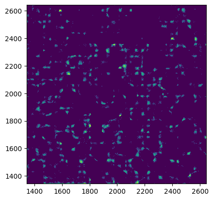
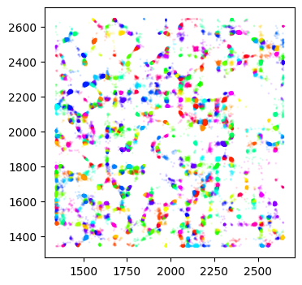

# Basic usage

Herdingspikes is best used in a python script or a Jupyter notebook. 

First, import the necessary modules:

```python
import spikeinterface.full as si
import herdingspikes as hs
```

We import SpikeInterface to pass the raw data as a RecordingExtractor object to HerdingSpikes.

## Specify the recording data

Next we create a RecordingExtractor object from a data file. The file used here can be downloaded from the [DANDI archive](https://dandiarchive.org/dandiset/000034/0.211030.0713/files?location=sub-P29-16-05-14-retina02-left&page=1). This recording was done by Gerrit Hilgen and Evelyne Sernagor (Newcaste University), and contains a short segment of data from a mouse retina. A BioCam with 1024 channels recorded simultaneously was used to record the data. The data is stored in a `.brw` file.


```python
rec = si.BiocamRecordingExtractor('P29_16_05_14_retina02_left_stim2_smallarray_fullfield_HDF5.brw')
```

Output:
```
BiocamRecordingExtractor: 1024 channels - 23.2kHz - 1 segments - 3,148,820 samples 
                          135.73s (2.26 minutes) - uint16 dtype - 6.01 GiB
```

Note that no data will be loaded into memory at this point. Data is only read from the file when it is needed. This makes it possible to work with very large datasets. 

## Detect spikes

```python
det = hs.HSDetectionLightning(rec)
det.DetectFromRaw()
```

The detection parameter can be passed as a [dictionary](#default-parameter-dictionary) to the `DetectFromRaw` method: `det = hs.HSDetectionLightning(rec, parameters)`.

The detected spikes can be inspected by plotting their spatial density:

```python
det.PlotDensity(binsize=4)
```
[](pictures/biocam_density.png)

## Cluster spikes

```python
C = hs.HSClustering(det)
C.ShapePCA()
C.CombinedClustering(
    alpha=4.5,
    cluster_subset=None,
    bandwidth=4.0,
    bin_seeding=True,
    min_bin_freq=4,
    n_jobs=-1,
)
```

Now the clustering results can be inspected by plotting the spikes coloured by cluster membership:

```python
ax = C.PlotAll(invert=False, s=1, alpha=0.1)
ax.set_aspect("equal", "box")
```
[](pictures/biocam_clusters.png)   

The sorted spikes can then be converted to a SpikeInterface SortingExtractor object and stored for later use:

```python
sampling_frequency = rec.get_sampling_frequency()
spike_indexes = np.array(C.spikes.t)
spike_labels = np.array(C.spikes.cl)
sorting = si.NumpySorting.from_times_labels(spike_indexes, spike_labels, sampling_frequency)
sorting.save_to_folder('biocam_sorting', overwrite=True)
```

# Parameters <a name="parameters"></a>

## General parameters

- **localize**: Perform spike localization. (`bool`, `True`)
- **save_shape**: Save spike shape. (`bool`, `True`)
- **out_file**: Path and filename to store detection and clustering results. (`str`, `HS2_detected`)
- **verbose**: Print progress information. (`bool`, `True`)

## Detection parameters
- **chunk_size**:  Number of samples per chunk during detection. If `None`, a suitable value will be estimated. (`int`, `None`)
- **common_reference**: Method for common reference filtering, can be `average` or `median` (`str`, `median`)
- **rescale**: Automatically re-scale the data.  (`bool`, `True`)
- **rescale_value**: Factor by which data is re-scaled. (`float`, -1280.0)
- **threshold**: Spike detection threshold. (`float`, `8.0`)
- **spike_duration**: Maximum duration over which a spike is evaluated (ms). (`float`, `1.0`)
- **amp_avg_duration**: Maximum duration over which the spike amplitude  is evaluated (ms). (`float`, `0.4`)
- **min_avg_amp**: Minimum integrated spike amplitude for a true spike. (`float`, `1.0`)
- **AHP_thr**: Minimum value of the spike repolarisation for a true spike. (`float`, `1.0`)
- **neighbor_radius**: Radius of area around probe channel for neighbor classification (microns). (`float`, `90.0`)
- **inner_radius**: Radius of area around probe channel for spike localisation (microns). (`float`, `70.0`)
- **peak_jitter**: Maximum peak misalignment for synchronous spike (ms). (`float`, `0.25`)
- **rise_duration**: Maximum spike rise time, in milliseconds. (`float`, 0.26)
- **decay_filtering**: Exclude duplicate spikes based on spatial decay pattern, experimental. (`bool`,`False`)
- **decay_ratio**: Spatial decay rate for `decay_filtering`. (`float`,`1.0`)
- **left_cutout_time**: Length of cutout before peak (ms). (`float`, `0.3`)
- **right_cutout_time**: Length of cutout after peak (ms). (`float`, `1.8`)

## Clustering parameters

- **pca_ncomponents**: Number of principal components to use when clustering. (`int`, `2`)
- **pca_whiten**: If `True`, whiten data for PCA. (`bool`, `True`)
- **clustering_bandwidth**: Meanshift bandwidth, average spatial extent of spike clusters (microns). (`float`, `4.0`)
- **clustering_alpha**: Scalar for the waveform PC features when clustering. (`float`, `4.5`)
- **clustering_n_jobs**: Number of cores to use for clustering, use `-1` for all available cores. (`int`, `-1`)
- **clustering_bin_seeding**: Enable clustering bin seeding. (`bool`, `True`)
- **clustering_min_bin_freq**: Minimum spikes per bin for bin seeding. (`int`, `4`)
- **clustering_subset**: Number of spikes used to build clusters. All by default. (`int`, `None`)

## Default parameter dictionary <a name="default-parameter-dictionary"></a>

```python
parameters = {
    "bandpass": True,
    "freq_min": 300.0,
    "freq_max": 6000.0,
    "chunk_size": None,
    "rescale": True,
    "rescale_value": -1280.0,
    "common_reference": "median",
    "spike_duration": 1.0,
    "amp_avg_duration": 0.4,
    "threshold": 8.0,
    "min_avg_amp": 1.0,
    "AHP_thr": 0.0,
    "neighbor_radius": 90.0,
    "inner_radius": 70.0,
    "peak_jitter": 0.25,
    "rise_duration": 0.26,
    "decay_filtering": False,
    "decay_ratio": 1.0,
    "localize": True,
    "save_shape": True,
    "out_file": "HS2_detected",
    "left_cutout_time": 0.3,
    "right_cutout_time": 1.8,
    "verbose": True,
    "clustering_bandwidth": 4.0,
    "clustering_alpha": 4.5,
    "clustering_n_jobs": -1,
    "clustering_bin_seeding": True,
    "clustering_min_bin_freq": 4,
    "clustering_subset": None,
    "pca_ncomponents": 2,
    "pca_whiten": True,
}
```