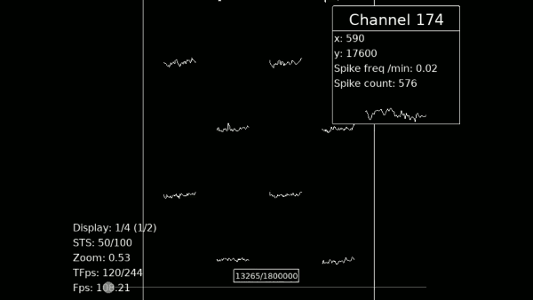
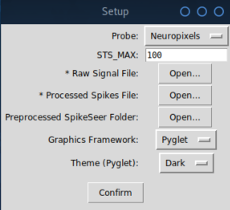
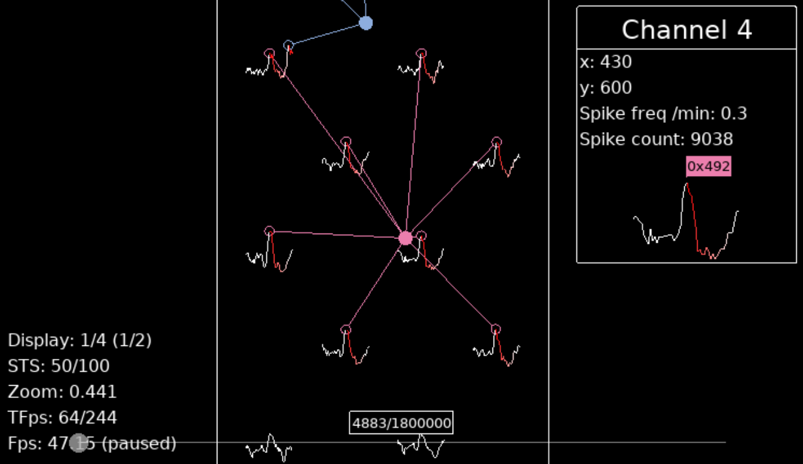

# SpikeSeer
**Visualising HS2 detected spikes**



Currently supported systems: BioCam and Neuroixel

Written by [Raimon Wintzer](https://github.com/lsIand)

### Pre-requisites

SpikeSeer is written in python (tested on Python 3.6). In addition to the requirements for [HS2](..), ``pyglet`` is a require package. Install with: ``conda install pyglet`` or ``pip install pyglet``.

### Using the program

#### Generating the requipred data files

SpikeSeer uses extended information written out during spike detection when the flag ``save_all`` is set to ``True`` during detection class is initialisation.

Example for Neuropixel:

```python
Probe = NeuroPixel(data_path, masked_channels=[])
H = HSDetection(Probe, to_localize, cutout_start, cutout_end, threshold,
                maa=0, maxsl=12, minsl=3, ahpthr=0, out_file_name=file_name,
                file_directory_name=file_directory, save_all=True)
```

Example for BioCam:

```python
Probe = BioCam(data_path)
H = HSDetection(Probe, to_localize, cutout_start, cutout_end, threshold,
                maa=0, maxsl=12, minsl=3, ahpthr=0, out_file_name=file_name, save_all=True)
```

Then the spike detection will generate two additional files with a complete record of all detected spikes and duplicates and their assignments.

#### Running SpikeSeer

Start the program: ``python main.py``



In this window, select the probe type, the raw data file, and the file generated by HS2 detection whose name ends in ``_filtered_spikes.asc``. Note the detection generates two files, the other one (``_detected_spikes.asc``) is not required. Then click ``Confirm``.

Next the program will ask for a folder name to store temporary files for faster access, and generate these. Finally, a continuous stream of raw data and detected events will be shown. These temporary files can be re-used. Once complete, the following screen will show the raw data along with detected events:



The mouse can be used to move across the probe, to move across time on bottom of screen, and to select recording channels and events.

Keyboard shortcuts:
* ``X`` / ``Z``: in/decrease frame rate
* ``D`` / ``A``: in/decrease number of visible time steps
* ``R`` / ``E``: zoom in/out
* ``Y``: toggle the display mode (4 modes)
* ``SPACE`` : pause
* ``M``: Settings menu
